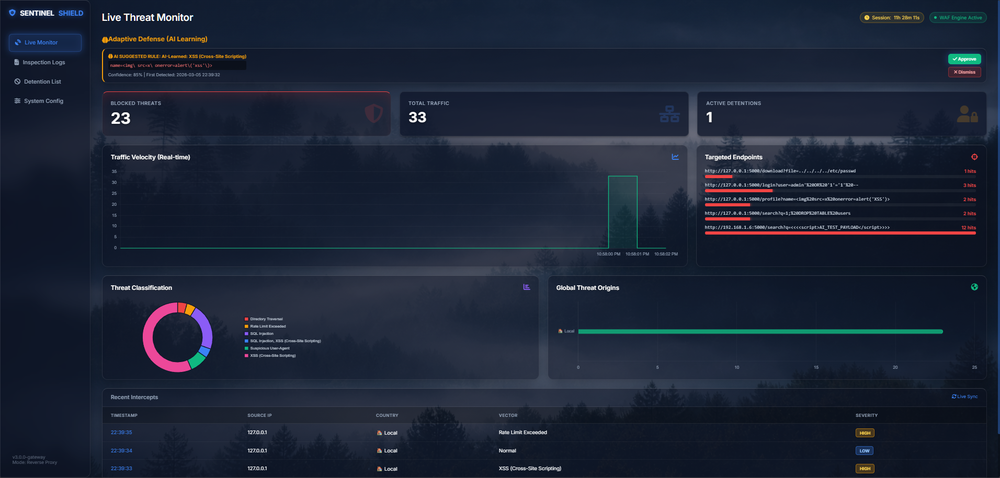
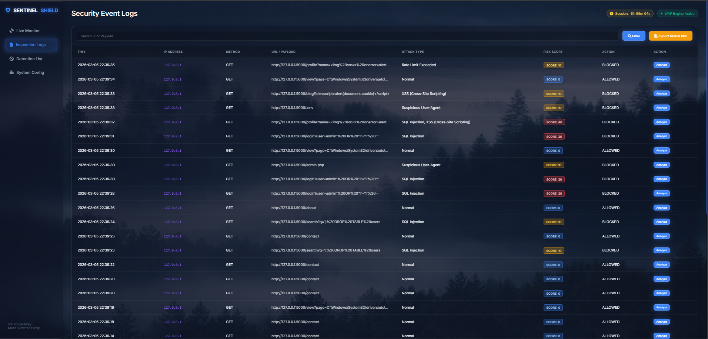
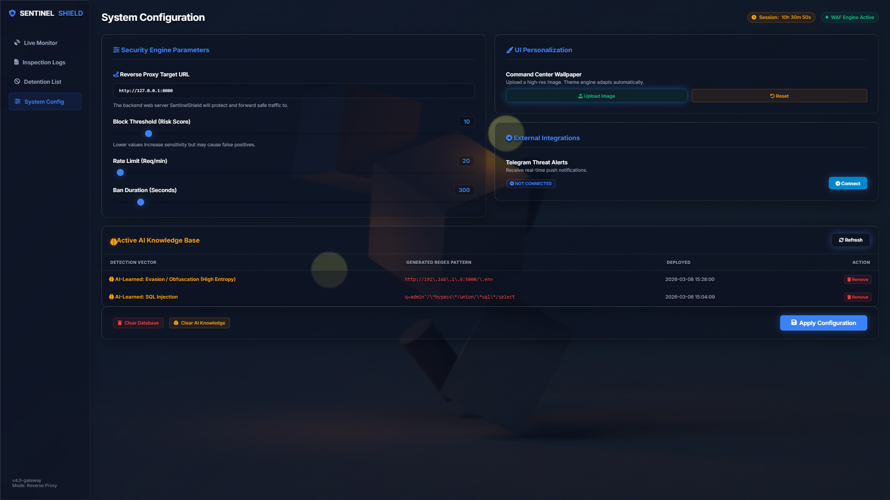
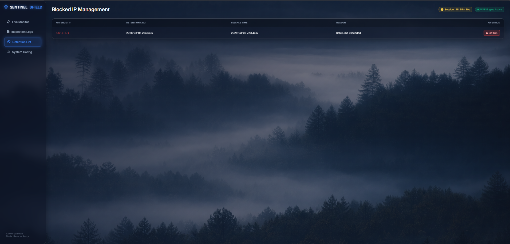

<div align="center">


# 🛡️ SentinelShield SOC v4.0

**An AI-Driven Next-Generation Web Application Firewall & Security Operations Center**



</div>

---

## ⚡ What is SentinelShield?

SentinelShield is an enterprise-grade **Web Application Firewall (WAF)** acting as a reverse proxy gateway.

It:
- Intercepts traffic
- Detects threats
- Blocks malicious requests before reaching backend

### 🚀 v4.0 Upgrade
- Predictive AI engine
- Zero-day detection
- Autonomous rule generation

---

## 📈 Evolution (v3.0 ➝ v4.0)

| Feature | v3.0 | v4.0 🚀 |
|--------|------|--------|
| Detection | Regex | ML (TF-IDF + Logistic Regression) |
| Evasion | URL decoding | Shannon Entropy detection |
| Bot Defense | Rate limiting | Behavioral fingerprinting |
| Rules | Manual | Auto self-healing |
| False Positives | High | Payload isolation |
| UI | Static | Glassmorphism + Live AI |
| Alerts | Hardcoded | Telegram OAuth |

---

## 📸 Interface

### Live Monitor


### Inspection Logs


### System Config


### Detention List


---

## 🛠️ Tech Stack

| Component | Tech |
|----------|-----|
| Backend | Flask (Python) |
| AI Engine | Scikit-Learn |
| Server | Waitress |
| DB | SQLite3 |
| Frontend | HTML/CSS/JS |
| Threat Intel | MaxMind, AbuseIPDB |

---

## 🚀 Installation Guide

### 1. Clone Repo

```bash
git clone https://github.com/akshatcore/SentinelShield.git
cd SentinelShield
````

### 2. Setup Virtual Environment

```bash
python -m venv venv
```

**Windows:**

```bash
venv\Scripts\activate
```

**Mac/Linux:**

```bash
source venv/bin/activate
```

---

### 3. Install Dependencies

```bash
pip install flask requests pyjwt bcrypt geoip2 reportlab waitress python-dotenv scikit-learn numpy
```

---

### 4. Configure Environment

Rename:

```
.env.example → .env
```

Edit `.env`:

```env
# WAF ROUTING
REVERSE_PROXY_URL=http://your-backend.com

# SECURITY
SECRET_KEY=your_secret
JWT_SECRET=your_jwt_secret
ADMIN_USER=admin
ADMIN_PASS=strong_password

# OPTIONAL
TELEGRAM_BOT_TOKEN=your_token
ABUSEIPDB_API_KEY=your_api_key
```

---

### 5. Add Required Files

* `static/background.jpeg` → UI wallpaper
* `GeoLite2-City.mmdb` → place in root folder

---

### 6. Run Server

```bash
python app.py
```

Access dashboard:

```
http://127.0.0.1:5000/
```

---

---

## 🌐 Live Deployment

Experience SentinelShield in action:

🔗 **Live Demo:** https://sentinelshield-1.onrender.com/

> ⚡ Fully functional AI-powered WAF dashboard with real-time monitoring, threat detection, and SOC interface.

---

## 👨‍💻 Author

**Akshat Tiwari**
GitHub: [https://github.com/akshatcore](https://github.com/akshatcore)

---

## ⚠️ Disclaimer

This project is for **defensive cybersecurity purposes only**.

Do NOT:

* attack systems without permission
* misuse replay/forensics tools
